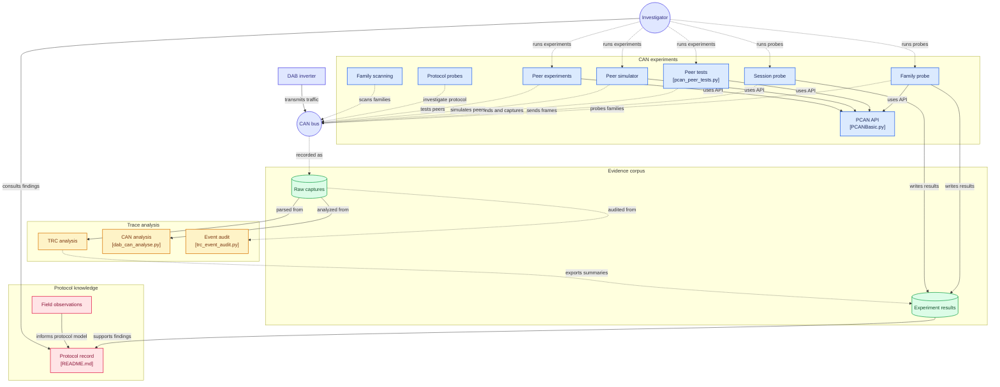

# Project Diagram

```mermaid
%%{init: {"flowchart": {"htmlLabels": true, "curve": "basis"}}}%%
flowchart TD

subgraph group_experiments["CAN experiments"]
  node_pcan["PCAN API<br/>[PCANBasic.py]"]
  node_familyprobe["Family probe"]
  node_sessionprobe["Session probe"]
  node_peerbase["Peer tests<br/>[pcan_peer_tests.py]"]
  node_peerchatbot["Peer simulator"]
  node_peerchatgpt["Peer experiments"]
  node_family_scan["Family scanning"]
  node_other_probes["Protocol probes"]
end

subgraph group_analysis["Trace analysis"]
  node_trc_analyze["TRC analysis"]
  node_can_analyze["CAN analysis<br/>[dab_can_analyse.py]"]
  node_event_audit["Event audit<br/>[trc_event_audit.py]"]
end

subgraph group_evidence["Evidence corpus"]
  node_raw_captures[("Raw captures")]
  node_results[("Experiment results")]
end

subgraph group_knowledge["Protocol knowledge"]
  node_knowledgebase["Protocol record<br/>[README.md]"]
  node_observations["Field observations"]
end

node_engineer(("Investigator"))
node_dut["DAB inverter"]
node_canbus(("CAN bus"))

node_engineer -.->|"runs probes"| node_familyprobe
node_engineer -.->|"runs probes"| node_sessionprobe
node_engineer -.->|"runs experiments"| node_peerbase
node_engineer -.->|"runs experiments"| node_peerchatbot
node_engineer -.->|"runs experiments"| node_peerchatgpt

node_familyprobe -->|"uses API"| node_pcan
node_peerbase -->|"uses API"| node_pcan
node_peerchatbot -->|"uses API"| node_pcan
node_peerchatgpt -->|"uses API"| node_pcan

node_familyprobe -.->|"probes families"| node_canbus
node_sessionprobe -.->|"sends frames"| node_canbus
node_peerbase -.->|"sends and captures"| node_canbus
node_peerchatbot -.->|"simulates peers"| node_canbus
node_peerchatgpt -.->|"tests peers"| node_canbus

node_dut -->|"transmits traffic"| node_canbus

node_canbus -.->|"recorded as"| node_raw_captures

node_raw_captures -->|"parsed from"| node_trc_analyze
node_raw_captures -->|"analyzed from"| node_can_analyze
node_raw_captures -.->|"audited from"| node_event_audit

node_familyprobe -->|"writes results"| node_results
node_sessionprobe -->|"writes results"| node_results
node_trc_analyze -.->|"exports summaries"| node_results

node_results -->|"supports findings"| node_knowledgebase
node_observations -->|"informs protocol model"| node_knowledgebase
node_engineer -->|"consults findings"| node_knowledgebase

node_other_probes -.->|"investigate protocol"| node_canbus
node_family_scan -.->|"scans families"| node_canbus

click node_pcan "https://github.com/robbertjv/dab-dconnect-active-driver-plus/blob/main/scripts/misc/PCANBasic.py"
click node_familyprobe "https://github.com/robbertjv/dab-dconnect-active-driver-plus/blob/main/scripts/probing/dab_family_probe.py"
click node_sessionprobe "https://github.com/robbertjv/dab-dconnect-active-driver-plus/blob/main/scripts/probing/dab_can_session_probe.py"
click node_peerbase "https://github.com/robbertjv/dab-dconnect-active-driver-plus/blob/main/scripts/probing/pcan_peer_tests.py"
click node_peerchatbot "https://github.com/robbertjv/dab-dconnect-active-driver-plus/blob/main/scripts/probing/pcan_peer_tests_chatbot.py"
click node_peerchatgpt "https://github.com/robbertjv/dab-dconnect-active-driver-plus/blob/main/scripts/probing/pcan_peer_tests_chatgpt.py"
click node_family_scan "https://github.com/robbertjv/dab-dconnect-active-driver-plus/blob/main/scripts/probing/dab_family_scanner.py"
click node_other_probes "https://github.com/robbertjv/dab-dconnect-active-driver-plus/tree/main/scripts/probing"

click node_trc_analyze "https://github.com/robbertjv/dab-dconnect-active-driver-plus/blob/main/scripts/analysis/trc_summarize_new.py"
click node_can_analyze "https://github.com/robbertjv/dab-dconnect-active-driver-plus/blob/main/scripts/analysis/dab_can_analyse.py"
click node_event_audit "https://github.com/robbertjv/dab-dconnect-active-driver-plus/blob/main/scripts/analysis/trc_event_audit.py"

click node_raw_captures "https://github.com/robbertjv/dab-dconnect-active-driver-plus/tree/main/data/raw"
click node_results "https://github.com/robbertjv/dab-dconnect-active-driver-plus/tree/main/data/results"
click node_knowledgebase "https://github.com/robbertjv/dab-dconnect-active-driver-plus/blob/main/README.md"
click node_observations "https://github.com/robbertjv/dab-dconnect-active-driver-plus/tree/main/data/observations"

classDef toneNeutral fill:#f8fafc,stroke:#334155,stroke-width:1.5px,color:#0f172a
classDef toneBlue fill:#dbeafe,stroke:#2563eb,stroke-width:1.5px,color:#172554
classDef toneAmber fill:#fef3c7,stroke:#d97706,stroke-width:1.5px,color:#78350f
classDef toneMint fill:#dcfce7,stroke:#16a34a,stroke-width:1.5px,color:#14532d
classDef toneRose fill:#ffe4e6,stroke:#e11d48,stroke-width:1.5px,color:#881337
classDef toneIndigo fill:#e0e7ff,stroke:#4f46e5,stroke-width:1.5px,color:#312e81
classDef toneTeal fill:#ccfbf1,stroke:#0f766e,stroke-width:1.5px,color:#134e4a

class node_pcan,node_familyprobe,node_sessionprobe,node_peerbase,node_peerchatbot,node_peerchatgpt,node_family_scan,node_other_probes toneBlue
class node_trc_analyze,node_can_analyze,node_event_audit toneAmber
class node_raw_captures,node_results toneMint
class node_knowledgebase,node_observations toneRose
class node_engineer,node_dut,node_canbus toneIndigo
```
