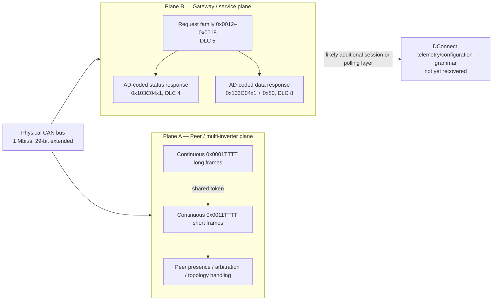

<pre># DAB Active Driver Plus M/M 1.5 CAN Protocol Reverse Engineering

**Repository document:** `README.md`  
**Status:** Consolidated working knowledge base  
**Language:** English  
**Consolidation date:** 2026-10-01  
**Device under test:** DAB Active Driver Plus M/M 1.5  
**Test constraint:** One physical inverter was available  
**Instrumentation:** PEAK PCAN-USB; `PCAN_USBBUS1` injector and `PCAN_USBBUS2` observer  
**Bus:** Classical CAN, 1 Mbit/s, 29-bit extended identifiers
**Needs:** Traces, Samples, Logs of communication between "D connect Box" and "Active Driver Plus", "ADAC", "MCE/C" or "MCE/P".

&gt; [!IMPORTANT]
&gt; This is a reverse-engineered description, not a DAB specification. It consolidates all DOCX reports in the project and resolves earlier hypotheses against the latest evidence. Fields marked **unknown** must not be treated as stable protocol definitions.

---

## 1. Purpose

This document is the single Git-ready technical record for the DAB Active Driver Plus CAN investigation. It:

- consolidates the project DOCX files into one evidence-based narrative;
- separates demonstrated facts from hypotheses;
- distinguishes two logical protocol planes that share the same physical CAN bus;
- documents the protocol grammar and address mapping recovered so far;
- records negative results to prevent duplicate testing;
- identifies data-quality limitations and superseded interpretations;
- provides Mermaid diagrams suitable for GitHub/GitLab rendering;
- provides a structured reference list for the underlying logging files.

The immediate objective is no longer blind CAN discovery. The peer/discovery layer and one deterministic service transaction are substantially understood. The remaining objective is to recover the DConnect request/polling grammar that exposes telemetry, parameters, faults, and firmware information.

---

## 2. Executive summary

The observed traffic separates into two logical planes:

| Plane | Name used here | Main identifiers | Behaviour | Current understanding |
|---|---|---|---|---|
| A | Peer plane | `0x0001xxxx`, `0x0011xxxx` | Continuous, unsolicited, high-rate, token-randomised | Frame structure mapped; operational semantics unresolved |
| B | Gateway/service plane | Requests `0x0012xxxx`–`0x0018xxxx`; responses `0x103C04xx` | Deterministic request/response bursts | Family window, token irrelevance, and AD address encoding demonstrated |

The principal solved result is the Plane B address response. The configured inverter address `AD` is encoded redundantly in the response identifier and payload. The mapping was predicted correctly for AD 1 through 8 in 24 of 24 tests.

The principal unsolved result is the command and telemetry layer. No reliable CAN encoding has yet been found for pressure, frequency, current, power, start/stop state, setpoint, faults, or configuration values. Existing P4 experiments do not support pressure-correlation claims because requested pressure labels did not match the actual measured/displayed pressure.

The official DConnect documentation establishes that a DConnect Box can discover an Active Driver Plus, display operating values, change parameters, show histories, and perform firmware-related operations over the same product-specific three-wire connection. The highest-value next step is therefore DConnect software and firmware archaeology, followed by narrowly targeted CAN validation.

---

## 3. Evidence classification

The following labels are used throughout:

- **Demonstrated:** directly reproduced in valid captures or documented by official manuals.
- **Strong hypothesis:** fits all current observations but is not uniquely proven.
- **Open:** insufficient evidence.
- **Rejected:** contradicted by later or stronger evidence.
- **Invalid run:** transmission or logging occurred, but receive-side evidence was absent or defective.

---

## 4. System and physical layer

| Property | Conclusion | Confidence |
|---|---|---|
| Physical layer | CAN | Demonstrated |
| Bitrate | 1 Mbit/s | Demonstrated |
| Identifier type | 29-bit extended | Demonstrated |
| CAN generation | Classical CAN; DLC up to 8 | Demonstrated |
| Application protocol | Proprietary DAB protocol | High |
| CANopen | Not supported by observed identifiers or traffic | Rejected as direct model |
| J1939 | No viable PGN/source-address interpretation found | Rejected as direct model |
| Product connector | J1 on the M/M model | Documented |
| Multi-inverter capacity | Up to eight units | Documented |
| Address setting | Automatic or manual AD 1–8 | Documented |
| Separate CRC/checksum | Not identified in the recovered frame forms | Open |

The DConnect documentation indicates that the same three-wire Active Driver Plus connection can be used for other Active Driver Plus units and/or a DConnect Box. The official DConnect cable includes a 120-ohm termination at the DConnect end.

---

## 5. Overall protocol model



The two planes must not be conflated. Plane A traffic is spontaneous and continuous. Plane B is stimulus-driven and deterministic.

---

## 6. CAN identifier decomposition

For the frame types discussed here, the working decomposition is:

```text
29-bit CAN identifier

bit 28                                      bit 16 bit 15                    bit 0
+------------------------------------------------+-------------------------------+
| Upper family / class / slot field (13 bits)   | 16-bit token or low-ID field  |
+------------------------------------------------+-------------------------------+

CAN_ID = (family &lt;&lt; 16) | low16
```

For Plane A and Plane B requests, `low16` is the transmitted token. In Plane B responses, `low16` instead contains a deterministic service/address field.

The upper field is called **family** in the logging tools. That name is operational, not a final semantic definition. Depending on the plane, it may contain class, service, slot, source, destination, role, or flag information.

---

## 7. Plane A — peer and topology-management traffic

### 7.1 Recurring frame pair

Frames occur as ordered pairs with a shared 16-bit token `TTTT`:

| Order | CAN ID | DLC | Payload | Working name |
|---|---:|---:|---|---|
| 1 | `0x0001TTTT` | 7 | `01 00 00 0F MM LL HH` | Long frame |
| 2 | `0x0011TTTT` | 5 | `01 00 00 LL HH` | Short frame |

Where:

- `TTTT = 0xHHLL`;
- payload bytes `LL HH` reproduce the token in little-endian order;
- `MM` is normally `0x03`, occasionally `0x04`, and has also been observed as `0x00` or `0x05`.

Example:

```text
CAN ID: 0x0001D341   DLC 7   DATA: 01 00 00 0F 03 41 D3
CAN ID: 0x0011D341   DLC 5   DATA: 01 00 00 41 D3

Token in identifier: 0xD341
Token in payload:    41 D3
```

### 7.2 Pair timing

```mermaid
sequenceDiagram
    participant DUT as Active Driver Plus
    participant BUS as CAN bus

    loop Approximately every 5 ms
        DUT-&gt;&gt;BUS: 0x0001TTTT, DLC 7\n01 00 00 0F MM LL HH
        Note over DUT,BUS: approximately 0.1–0.3 ms
        DUT-&gt;&gt;BUS: 0x0011TTTT, DLC 5\n01 00 00 LL HH
    end
```

Quantitative characteristics:

- approximately 200 long/short pairs per second;
- approximately 400 frames per second aggregate;
- nearly complete pair matching;
- near-uniform token use over the 16-bit range;
- tokens are not sequential and are not derived from AD;
- the token is best treated as a transaction nonce, correlation value, collision-avoidance value, or internal consistency field.

### 7.3 Marker byte

| Marker | Observation | Current interpretation |
|---:|---|---|
| `0x03` | Approximately 99.7% of normal long frames | Normal/default marker; exact meaning open |
| `0x04` | Approximately 0.3%; transient | Event or state transition; cause not isolated |
| `0x00` | Appeared near the beginning of many captures but not all | Not a universal startup marker |
| `0x05` | Rare incidental observation | Unknown |

### 7.4 Injection findings

| Injection | Frames sent | Observed reaction |
|---|---:|---|
| Short frame only (`0x0011`) | 2,999 | Display showed `Wait...` |
| Long frame only (`0x0001`) | 2,999 | No visible reaction |
| Correct pair, long then short | 5,996 | Communication icon flashed once near start |
| Reverse pair, short then long | 5,998 | Communication icon flashed once near start |

Interpretation:

- the short form is sufficient to trigger the known state reaction;
- the long form alone is inert in this test;
- pair order did not materially change the outcome;
- the natural pair is not a sufficient complete peer-admission handshake.

### 7.5 Hierarchy and displayed unit count

Later hierarchy tests showed that sustained synthetic address activity affected the displayed number of units `N`:

- one simulated address generally produced `N=1`;
- two simultaneous simulated addresses (`3+5` and `2+3`) produced `N=2`;
- stopping one simulated address returned `N` to 1;
- `VP=0.0` was observed with two simulated addresses;
- one early address-3 test produced an error, while later repetitions were more stable.

This demonstrates that Plane A belongs to genuine multi-inverter topology management. It does not yet expose the higher-level run-sharing or telemetry grammar.

### 7.6 Plane A negative results

The following paths are exhausted for the tested grammar:

- fixed, random, incrementing, or structured token choice did not change admission behaviour;
- injection periods from 500 ms down to 5 ms showed no useful threshold;
- verbatim replay did not produce durable address acquisition;
- simulating one, two, or four peer controllers did not establish a persistent fully admitted network;
- no stable pressure, frequency, current, run-state, or setpoint field was identified;
- passive AD changes did not alter the recurring `0x0001/0x0011` family prefixes.

### 7.7 Plane A working hypothesis

Plane A is most consistent with a high-rate presence, arbitration, liveness, or topology-management beacon. The rapidly changing token could be a nonce used during contention or collision avoidance. Operational multi-pump traffic may remain gated until a genuine peer is admitted, which has not been achieved with a single physical inverter and synthetic traffic.

---

## 8. Plane B — gateway/service request-response traffic

### 8.1 Request grammar

```text
CAN ID:  (FAMILY &lt;&lt; 16) | TOKEN
DLC:     5
DATA:    01 00 00 LL HH
```

Where `TOKEN = 0xHHLL`.

Historical canonical probe:

```text
CAN ID:  0x0012C82D
DLC:     5
DATA:    01 00 00 2D C8
```

`C82D` has no special command meaning. It is retained only as a known-valid historical reference value.

### 8.2 Accepted family window

The complete scan and boundary tests demonstrated:

| Family range | Response |
|---|---|
| `0x0010`, `0x0011` | No |
| `0x0012`–`0x0018` | Yes |
| `0x0019`, `0x001A` | No |
| `0x0810`, `0x0811` | No |
| `0x0812`–`0x0818` | Yes |
| `0x0819`, `0x081A` | No |

Conclusions:

1. The accepted low-family window is exactly `0x12` through `0x18`.
2. Family bit `0x0800` is ignored or masked for this handler.
3. The effective family comparison is consistent with a mask near `0x07FF`.
4. The seven accepted values are more likely service/function selectors than direct local addresses.

### 8.3 Token irrelevance

Three complete 32-token sweeps on family `0x0012` produced 480 responses from 480 probes. Values included:

```text
0000  0001  1234  7FFF  8000  FFFF  C82D
```

and 25 pseudo-random values.

A comparable token sweep using family `0x0011` produced 0 responses from 160 probes.

Therefore, for this transaction the token is not:

- an address;
- a key;
- a selector;
- a checksum;
- an authentication value.

It is transport padding or a correlation field whose exact value is irrelevant to acceptance.

### 8.4 Response burst

An accepted request produces two response streams, normally 17 frames each, over approximately 80 ms:

```mermaid
sequenceDiagram
    participant HOST as Injector / gateway role
    participant DUT as Active Driver Plus

    HOST-&gt;&gt;DUT: 0x0012TTTT, DLC 5\n01 00 00 LL HH
    Note over HOST,DUT: First response normally within 0–16 ms
    loop Approximately 17 cycles at approximately 5 ms
        DUT--&gt;&gt;HOST: STATUS_ID, DLC 4\n00 00 00 AD (plus observed variant)
        DUT--&gt;&gt;HOST: DATA_ID, DLC 8\n00 00 00 00 00 10 NN A4
    end
    Note over HOST,DUT: Total burst normally 32 or 34 frames\nDuration approximately 78–94 ms
```

No late response frames were found in the validated gateway session.

### 8.5 Solved AD address encoding

The response identifiers are deterministic functions of configured `AD`:

```text
STATUS_ID = 0x103C0401 + ((AD - 1) &lt;&lt; 4)
DATA_ID   = STATUS_ID + 0x80
```

| AD | Status ID | Data ID | Status payload | Data tail byte |
|---:|---:|---:|---|---:|
| 1 | `103C0401` | `103C0481` | `00 00 00 01` | `0x14` |
| 2 | `103C0411` | `103C0491` | `00 00 00 02` | `0x24` |
| 3 | `103C0421` | `103C04A1` | `00 00 00 03` | `0x34` |
| 4 | `103C0431` | `103C04B1` | `00 00 00 04` | `0x44` |
| 5 | `103C0441` | `103C04C1` | `00 00 00 05` | `0x54` |
| 6 | `103C0451` | `103C04D1` | `00 00 00 06` | `0x64` |
| 7 | `103C0461` | `103C04E1` | `00 00 00 07` | `0x74` |
| 8 | `103C0471` | `103C04F1` | `00 00 00 08` | `0x84` |

Derived payload rules:

```text
Status frame, DLC 4:
00 00 00 AD

Observed status variant:
00 00 ((AD - 1) &lt;&lt; 4) AD

Data frame, DLC 8:
00 00 00 00 00 10 NN ((AD &lt;&lt; 4) | 0x04)
```

The address is encoded in three places:

1. status identifier offset;
2. status payload;
3. data-frame tail byte.

This triple redundancy strongly supports a discovery/enumeration service interpretation.

### 8.6 Response identifier diagram

```mermaid
flowchart TD
    AD[Configured address AD: 1..8]
    O[Offset = AD - 1]
    S[STATUS_ID = 0x103C0401 + Offset × 0x10]
    D[DATA_ID = STATUS_ID + 0x80]
    SP[Status payload ends in AD]
    DP[Data payload ends in (AD &lt;&lt; 4) | 0x04]

    AD --&gt; O
    O --&gt; S
    S --&gt; D
    AD --&gt; SP
    AD --&gt; DP
```

### 8.7 The `NN` byte

Byte 6 of the standard data response changes slowly and monotonically across a session. Observed values include `0x57`, `0x58`, `0x59`, `0x5B`–`0x5E`, and `0x60+` in later sessions. It is more consistent with an uptime/session counter than with a process variable.

### 8.8 Rich data-frame variants

Some boundary and token-sweep captures contain structured non-zero bytes in positions 0–5, for example:

```text
15 0A 00 00 31 90 63 14
1F 37 00 10 E7 92 6C 14
66 26 00 00 16 91 5A 14
0C 3F 00 10 7F 94 57 14
```

These retain the address-coded final byte but contain changing leading fields. This is the most promising open artefact in the current logs. It may be a multi-field record whose normal template is zero-filled. The condition that produces these variants has not been isolated.

### 8.9 Settling behaviour

Immediately after changing AD, the first one to four probes sometimes failed. One AD=4 probe returned the previous AD=3 response pair. Future tests must include a documented settling period after configuration changes. Otherwise stale responses or transient non-responses can be misclassified as protocol acceptance rules.

---

## 9. Pressure and process-state experiments

Two P4 campaigns attempted to relate gateway responses to states labelled pump-off, 2.0 bar, 2.2 bar, and 2.5 bar.

| Labelled condition | Campaign 1 | Campaign 2 |
|---|---:|---:|
| Pump off / 0.0 bar | 5/5 responses | 0/5 responses |
| 2.0 bar | 5/5 | 0/5 |
| 2.2 bar | 1/5 | 1/5 |
| 2.5 bar | 0/5 | 2/5 |
| Final pump-off | 0/5 | 0/5 |

The campaigns are contradictory. Response availability is not demonstrated to be pressure-dependent.

Data-quality limitation:

- operator notes show actual/displayed pressure around 3.1–3.2 bar during phases labelled 2.0, 2.2, and 2.5 bar;
- the final phase cycled roughly between 1.6 and 3.2 bar;
- no synchronised 2.6 bar point was recorded;
- requested labels therefore cannot be used as measured process values.

No valid pressure, current, speed, power, setpoint, or run-state encoding has been established from these captures.

---

## 10. DConnect implications

Official documentation demonstrates that DConnect can:

- search for and identify an Active Driver Plus;
- display operating parameters;
- change and transmit configuration parameters;
- display historical graphs;
- recognise firmware versions;
- update older firmware through a loader mode.

The minimum expected telemetry vocabulary includes:

| Code | Meaning |
|---|---|
| `FR` | Operating frequency |
| `VP` | Pressure |
| `C1` | Phase current |
| `PO` | Power |
| `VF` | Flow present/absent |
| `TE`, `BT` | Temperatures |
| `FF` | Fault history |
| `HO` | Operating hours |
| `EN` | Energy |
| `SN` | Number of starts |
| `VE` | Hardware/software version |

The available evidence supports at least two product-level protocol modes:

1. normal discovery/configuration/runtime communication;
2. loader and firmware transfer.

The investigated traffic has not yet revealed the polling requests that expose the listed telemetry. The spontaneous Plane A beacon is too small and too randomised to carry all of these values directly.

---

## 11. Consolidated conclusions

### 11.1 Demonstrated

- The bus is Classical CAN at 1 Mbit/s using 29-bit extended identifiers.
- Plane A uses paired `0x0001TTTT`/`0x0011TTTT` frames at approximately 200 pairs/s.
- Plane A tokens occupy CAN-ID low 16 bits and are echoed little-endian in the payload.
- Passive AD changes do not alter the Plane A family prefixes.
- The Plane A short form can trigger a visible state reaction without the long form.
- Synthetic address activity can affect displayed topology count `N`.
- Plane B accepts request families `0x0012`–`0x0018` and their `+0x0800` aliases.
- Adjacent families outside that window do not invoke the same handler.
- Plane B token value is irrelevant to acceptance.
- Plane B responses deterministically encode AD 1–8 in identifiers and payloads.
- A normal response is a 32/34-frame burst lasting about 80 ms.
- Validated sessions recorded zero CAN error frames.
- The known short request produces a temporary discovery/status response, not a persistent DConnect session.

### 11.2 Strong hypotheses

- Plane A is a presence, arbitration, liveness, or topology-management channel.
- Plane B is a discovery/enumeration or service handler.
- Family bit `0x0800` is masked or ignored by the Plane B receiver.
- Byte `NN` in the data response is an uptime/session counter.
- Higher-level process traffic is gated behind genuine peer or gateway admission.

### 11.3 Open

- The exact meaning of Plane A marker `0x04`.
- The full semantic subdivision of the 29-bit identifier.
- The distinction among accepted service families `0x0012`–`0x0018`.
- The trigger and interpretation of rich data-frame bytes 0–5.
- The DConnect device-identification request.
- Telemetry polling for FR, VP, C1, PO, VF, temperatures, hours, energy, starts, and faults.
- Parameter read/write grammar.
- Session maintenance and timeout behaviour.
- Loader and firmware-transfer messages.

### 11.4 Rejected or exhausted

- CANopen or J1939 as the direct application protocol.
- C82D as a magic token.
- Low 16 identifier bits as a permanent device address.
- A long/short pair as mandatory for the known 103C response.
- Further token brute-force testing against the same handler.
- Further blind family sweeps using the same short-frame grammar.
- Pressure correlation from the existing P4 datasets.
- The assumption that a separate pump-side multi-inverter commissioning wizard must be entered.

---

## 12. Project pathway

```mermaid
flowchart TD
    A[Official manuals\nCAN, AD 1–8, multi-inverter support] --&gt; B[December 2025 exploratory captures]
    B --&gt; C[Identify long/short token-matched pair]
    C --&gt; D[September 2026 passive AD captures]
    D --&gt; E{Did AD change Plane A prefixes?}
    E -- No --&gt; F[Reject simple AD-to-prefix mapping]
    F --&gt; G[Safe fake-node and peer injection]
    G --&gt; H{Durable peer admission?}
    H -- No --&gt; I[Listen-only and pump-run captures]
    I --&gt; J[No clear process telemetry]
    J --&gt; K[Token tests on family 0x0012]
    K --&gt; L[Prove token irrelevance]
    L --&gt; M[Family scans and full 13-bit brute force]
    M --&gt; N[Accepted windows 0x0012–0x0018 and aliases]
    N --&gt; O[AD map and AD matrix]
    O --&gt; P[Decode deterministic AD response mapping]
    P --&gt; Q[Hierarchy and node-minimal tests]
    Q --&gt; R[Confirm topology-management behaviour]
    R --&gt; S[P4 and gateway validation]
    S --&gt; T[No telemetry or pressure correlation demonstrated]
    T --&gt; U[Current direction: DConnect software archaeology]
    U --&gt; V[Targeted CAN validation only after concrete software clue]
```

---

## 13. Recommended next work

### Priority 1 — DConnect software archaeology

1. Mirror `ankohanse/pydabpumps` and `ankohanse/hass-dab-pumps`, including history, tags, and releases.
2. Extract endpoints, JSON keys, units, model identifiers, entity names, fault codes, and firmware strings.
3. Recover GPL/LGPL corresponding source for DConnect Box versions where available.
4. Inspect DConnect application packages, update manifests, firmware archives, resources, and binaries.
5. Search for strings and constants including:

```text
103C 0401 0481 0012 CANBUS ADPLUS ACTIVE_DRIVER
FR VP C1 PO VF TE BT FF HO EN SN VE
```

### Priority 2 — Isolate rich `103C04x1` payload variants

Vary one factor at a time:

- request family within `0x0012`–`0x0018`;
- request DLC;
- request bytes 0–2;
- inter-probe interval;
- time since power-up;
- menu or gateway state.

Success criterion: reproducible non-zero content in bytes 0–5 correlated with exactly one controlled input.

### Priority 3 — Targeted CAN validation

Return to active probing only when software analysis provides at least one concrete clue:

- arbitration identifier;
- request payload;
- product/profile identifier;
- parameter index;
- polling interval;
- checksum or sequence rule.

### Priority 4 — Real external actor, if eventually available

Passively capture a genuine second inverter or DConnect Box performing exactly one operation:

- device search;
- parameter read;
- harmless parameter change and restoration;
- start or stop;
- fault reset;
- firmware/version query.

### Priority 5 — Proper process correlation

If process correlation is revisited:

- log actual pressure continuously and synchronously;
- hold stable points such as 1.5, 2.0, 2.6, and 3.2 bar for 15–30 seconds;
- use passive capture only;
- record frequency, current, pump state, and timestamps from an independent source.

---

## 14. Reproducible reference transaction

```text
Bus:       Classical CAN, 1 Mbit/s, 29-bit extended
Condition: AD = 1, settled state
Request:   ID 0x0012C82D, DLC 5, DATA 01 00 00 2D C8
Expected:  32 or 34 response frames over approximately 80 ms
Status ID: 0x103C0401, DLC 4
Data ID:   0x103C0481, DLC 8
Errors:    Zero CAN error frames in validated sessions
```

---

## 15. Data quality and interpretation warnings

1. Files exported both with and without an AD suffix can be duplicates and must not be counted as independent runs.
2. Family-probe runs with `total_rx = 0` are transmission/logging diagnostics, not valid application-layer rejection tests.
3. The 14:26 family-probe run captured baseline RX but no receive traffic in probe windows and is not comparable to valid runs.
4. The approximately 3.445-second latency in the v31 token-test summary is a timing-reference artefact. Later raw captures show immediate responses.
5. Trace 013 and Trace 014 filenames contain `20260928`, while directory notes identify 25 September 2026. Preserve the discrepancy until acquisition metadata is corrected.
6. Early claims that the payload tail was a checksum are superseded by token-echo evidence.
7. Early claims that bitrate was unknown are superseded by validated 1 Mbit/s operation.
8. A stale AD response immediately after changing AD does not invalidate the mapping; it demonstrates the need for settling time.
9. Requested process-state labels must not substitute for synchronised measured values.
10. The DOCX files `DAB active Driver.docx` and `DAB active Driver-1.docx` are duplicates, as are `Token C82D.docx` and `Token C82D-1.docx`.

---

## 16. Logging-file reference

The following reference is organised by investigative purpose. Result/summary files should normally be consulted before raw files; raw files remain the source of truth for timing and frame-level verification.

### 16.1 December 2025 exploratory captures

- `Test_001_AD-1.CSV`
- `Test_002_AD-2.CSV`
- `Test_003_AD-2.CSV`
- `Test_004_AD-1.CSV`
- `Test_005_AD-1.CSV`
- `Test_006_AD-1.CSV`
- `Test_007_Run.CSV`
- `Test_008_Run.CSV`
- `Test_009.CSV`

Key use: original long/short grammar, natural C82D occurrences, and deliberate C82D reuse.

### 16.2 Passive CAN traces 001–017

- `can_Trace_001_20260925_1435_AD-1.csv`
- `can_Trace_002_20260925_1438_AD-1.csv`
- `can_Trace_003_20260925_1443_AD-1.csv`
- `can_Trace_004_20260925_1444_AD-1.csv`
- `can_Trace_005_20260925_1447_AD-1.csv`
- `can_Trace_006_20260925_1450_AD-1.csv`
- `can_Trace_007_20260925_1612_AD-1.csv`
- `can_Trace_008_20260925_1616_AD-0.csv`
- `can_Trace_009_20260925_1618_AD-0.csv`
- `can_Trace_010_20260925_1621_AD-2.csv`
- `can_Trace_011_20260925_1624_AD-2.csv`
- `can_Trace_012_20260925_1625_AD-3.csv`
- `can_Trace_013_20260928_1625_AD-3.csv`
- `can_Trace_014_20260928_1630_AD-0.csv`
- `can_Trace_015_20260928_2020_AD-0.csv`
- `can_Trace_016_20260928_2027_AD-0.csv`
- `can_Trace_017_20260928_2034_AD-0.csv`

Key use: passive grammar, AD comparisons, listen-only verification, and pump-run observation.

### 16.3 Controlled peer campaign

Primary consolidated files:

- `pcan_test_results chatbot - timeline_all.csv`
- `pcan_test_results chatbot - tx_attempts.csv`
- `pcan_test_results chatbot - rx_frames.csv`
- `pcan_test_results chatbot - phase_markers.csv`
- `pcan_test_results chatbot - baseline_timeline.csv`
- `pcan_test_results chatbot - test21_startmarker_timeline.csv`
- `pcan_test_results chatbot - test21_normal_timeline.csv`
- `pcan_test_results chatbot - test22_timeline.csv`
- `pcan_test_results chatbot - test23_dlc7_timeline.csv`
- `pcan_test_results chatbot - test23_dlc5_timeline.csv`
- `pcan_test_results chatbot - test23_pair_timeline.csv`
- `pcan_test_results chatbot - test24_timeline.csv`
- `pcan_test_results chatbot - manual_notes.json`
- `pcan_test_results chatbot - metadata.json`

Exported subsets:

- `pcan_peer_tests - Result - baseline.csv`
- `pcan_peer_tests - Result - test21_startmarker.csv`
- `pcan_peer_tests - Result - test21_normal.csv`
- `pcan_peer_tests - Result - test22.csv`
- `pcan_peer_tests - Result - test23_dlc7.csv`
- `pcan_peer_tests - Result - test23_dlc5.csv`
- `pcan_peer_tests - Result - test23_pair.csv`
- `pcan_peer_tests - Result - test24.csv`

### 16.4 Peer timing, replay, and multi-controller series

- `R1_short_reference.csv`
- `R2_addr1.csv`, `R2_addr3.csv`, `R2_addr5.csv`, `R2_addr8.csv`, `R2_addr9.csv`
- `R3_short_500.csv`, `R3_short_1000.csv`, `R3_short_2000.csv`
- `R4_a_short.csv`, `R4_b_pair.csv`, `R4_c_short.csv`
- `R5_process_start_stop.csv`
- `T01_fixed_short_500ms.csv`
- `T02_random_short_500ms.csv`
- `T03_short_100ms.csv`
- `T04_short_20ms.csv`
- `T05_short_5ms.csv`
- `T06_pair_marker03.csv`
- `T07_pair_start00_then03.csv`
- `T08_replay_one_controller_0012.csv`
- `T09_replay_during_discovery.csv`
- `T10_two_short_controllers_50Hz.csv`
- `T11_two_short_controllers_200Hz.csv`
- `T12_two_pair_controllers.csv`
- `T12_four_pair_controllers.csv`
- `T12_four_pair_controllers_2.csv`
- `T13_two_replayed_controllers.csv`
- `peer_2000ms_fixed.csv`
- `peer_fixed.csv`
- `peer_increment.csv`
- `peer_random.csv`
- `address_1_pair.csv`, `address_3_pair.csv`, `address_5_pair.csv`
- `test_A_short_only.csv`
- `test_B_long_only.csv`
- `test_C_pair.csv`
- `test_D_reverse.csv`

### 16.5 Token C82D and token-independence tests

- `dab_token_test_v31_baseline_20260928-1325.csv`
- `dab_token_test_v31_baseline_20260928-1329.csv`
- `dab_token_test_v31_events_20260928-1325.csv`
- `dab_token_test_v31_events_20260928-1329.csv`
- `dab_token_test_v31_raw_20260928-1325.csv`
- `dab_token_test_v31_raw_20260928-1329.csv`
- `dab_token_test_v31_responses_20260928-1325.csv`
- `dab_token_test_v31_responses_20260928-1329.csv`
- `dab_token_test_v31_results_20260928-1325.csv`
- `dab_token_test_v31_results_20260928-1329.csv`
- `ad0_raw_20260928-1331.csv`
- `ad0_results_20260928-1331.csv`

### 16.6 Family-probe campaigns

Use each timestamped set as one run: `metadata`, `raw`, and `results`. Important result files include:

- `dab_family_probe_results_20260928-134706.csv`
- `dab_family_probe_results_20260928-134706_AD=1.csv`
- `dab_family_probe_results_20260928-135033.csv`
- `dab_family_probe_results_20260928-135033_AD=1.csv`
- `dab_family_probe_results_20260928-142602_AD=2.csv`
- `dab_family_probe_results_20260928-142818_AD=2.csv`
- `dab_family_probe_results_20260928-143214_AD=2.csv`
- `dab_family_probe_results_20260928-143624_AD=1.csv`
- `dab_family_probe_results_20260928-143938_AD=1.csv`
- `dab_family_probe_results_20260928-144153.csv`
- `dab_family_probe_results_20260928-144939.csv`
- `dab_family_probe_results_20260928-145528.csv`
- `dab_family_probe_results_20260928-145716.csv`
- `dab_family_probe_results_20260928-145745.csv`
- `dab_family_probe_results_20260928-150320_AD=2.csv`
- `dab_family_probe_results_20260928-150605_AD=2.csv`

Corresponding files use the prefixes:

- `dab_family_probe_raw_...`
- `dab_family_probe_metadata_...`

Treat zero-RX runs as diagnostics, not protocol rejection evidence.

### 16.7 Hierarchy tests

- `dab_hierarchy_raw_20260929-160904.csv`
- `dab_hierarchy_events_20260929-160904.csv`
- `dab_hierarchy_observations_20260929-160904.csv`
- `dab_hierarchy_metadata_20260929-160904.json`

Key use: topology count `N`, multiple synthetic addresses, recovery behaviour, and operator observations.

### 16.8 AD map and service-family scans

AD map:

- `ad_map_20260930-091029_ad-map.csv`
- `raw_20260930-091029_ad-map.csv`
- `events_20260930-091029_ad-map.csv`
- `metadata_20260930-091029_ad-map.json`

Smart banks and scan:

- `results_20260930-091334_smart-banks.csv`
- `raw_20260930-091334_smart-banks.csv`
- `events_20260930-091334_smart-banks.csv`
- `results_20260930-091423_smart-banks.csv`
- `raw_20260930-091423_smart-banks.csv`
- `events_20260930-091423_smart-banks.csv`
- `results_20260930-091528_scan.csv`
- `raw_20260930-091528_scan.csv`
- `events_20260930-091528_scan.csv`

Full brute-force result sets:

- `results_20260930-091638_brute-force.csv`
- `results_20260930-092215_brute-force.csv`
- `results_20260930-092528_brute-force.csv`
- `events_20260930-091638_brute-force.csv`
- `events_20260930-092215_brute-force.csv`
- `events_20260930-092528_brute-force.csv`
- `raw_20260930-091638_brute-force.csv`
- `raw_20260930-092215_brute-force.csv`
- `raw_20260930-092528_brute-force_part_1.csv` through `raw_20260930-092528_brute-force_part_9.csv`
- matching `checkpoint_...` and `metadata_...` JSON files

### 16.9 Boundary, alias, AD-matrix, and token-sweep validation

Boundary:

- `results_20260930-125812_boundary.csv`
- `raw_20260930-125812_boundary.csv`
- `events_20260930-125812_boundary.csv`
- `results_20260930-132839_boundary.csv`
- `raw_20260930-132839_boundary.csv`
- `events_20260930-132839_boundary.csv`

Alias:

- `results_20260930-125938_alias.csv`
- `raw_20260930-125938_alias.csv`
- `events_20260930-125938_alias.csv`

AD matrix:

- `results_20260930-130418_ad-matrix.csv`
- `raw_20260930-130418_ad-matrix.csv`
- `events_20260930-130418_ad-matrix.csv`

Token sweeps:

- `results_20260930-131039_token-sweep.csv`
- `raw_20260930-131039_token-sweep.csv`
- `results_20260930-131329_token-sweep.csv`
- `raw_20260930-131329_token-sweep.csv`
- `results_20260930-133026_token-sweep.csv`
- `raw_20260930-133026_token-sweep.csv`
- `results_20260930-133353_token-sweep.csv`
- `raw_20260930-133353_token-sweep.csv`

### 16.10 Node-minimal, P4, and gateway tests

Node-minimal:

- `events_20260930-131454_node-minimal.csv`
- `metadata_20260930-131454_node-minimal.json`

P4 campaign 1:

- `polls_20260930-090710_p4.csv`
- `raw_20260930-090710_p4.csv`
- `events_20260930-090710_p4.csv`
- `observations_20260930-090710_p4.csv`
- `metadata_20260930-090710_p4.json`

P4 campaign 2:

- `results_20260930-131751_p4.csv`
- `raw_20260930-131751_p4.csv`
- `events_20260930-131751_p4.csv`
- `metadata_20260930-131751_p4.json`

Gateway validation:

- `results_20260930-150922.csv`
- `events_20260930-150922.csv`
- `summary_20260930-150922.json`
- `metadata_20260930-150922.json`
- `raw_20260930-150837.csv`
- `events_20260930-150837.csv`
- `metadata_20260930-150837.json`

---

## 17. Source DOCX files consolidated

- `DAB active Driver.docx`
- `DAB active Driver-1.docx` — duplicate export
- `DAB Active Driver Plus CAN Reverse Engineering Test Plan.docx`
- `DAB Active Driver Plus M-M 1.5 CAN Reverse-Engineering.docx`
- `DAB Active Driver Plus M-M 1.5 — CAN Protocol Reverse-Engineering Dossier.docx`
- `Integrated Reconstruction — DAB Active Driver Plus CAN.docx`
- `Safe discovery probes.docx`
- `Test aan de hand van het inverter adres.docx`
- `Token C82D.docx`
- `Token C82D-1.docx` — duplicate export

---

## 18. Suggested repository layout

```text
.
├── README.md
├── docs/
│   ├── source-docx/
│   ├── manuals/
│   └── figures/
├── data/
│   ├── raw/
│   ├── results/
│   ├── events/
│   ├── metadata/
│   └── observations/
├── scripts/
│   ├── capture/
│   ├── probing/
│   └── analysis/
└── archive/
    └── superseded-notes/
```

Recommended conventions:

- keep original captures immutable;
- store generated summaries separately from raw logs;
- add a SHA-256 manifest for large logs;
- document duplicate exports explicitly;
- use ISO 8601 UTC timestamps;
- preserve hexadecimal fields as zero-padded strings;
- add `README.md` files under each data directory explaining columns and provenance;
- use Git LFS or external release storage for very large raw captures;
- never infer process values from operator labels without synchronised measurements.

---

## 19. Final direction

The investigation has progressed from apparently random beacon traffic to:

- a mapped peer-plane frame grammar;
- a demonstrated topology-management effect;
- a complete accepted service-family window;
- proven token irrelevance;
- a deterministic AD 1–8 response mapping;
- a reproducible reference transaction.

Blind fuzzing is now low value. The missing information is the gateway request grammar that exposes telemetry and configuration. The project should proceed with DConnect software archaeology and use the existing CAN dataset as a validation platform for concrete, externally derived protocol hypotheses.
</pre>
